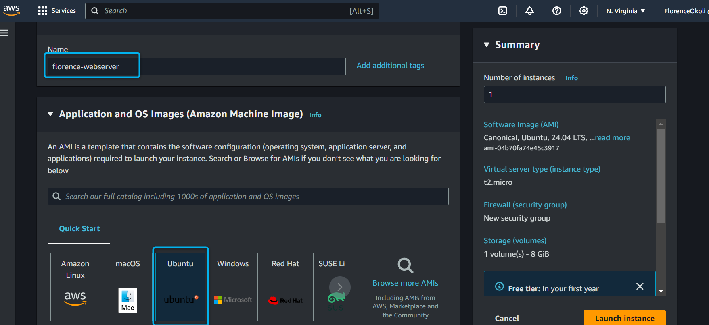
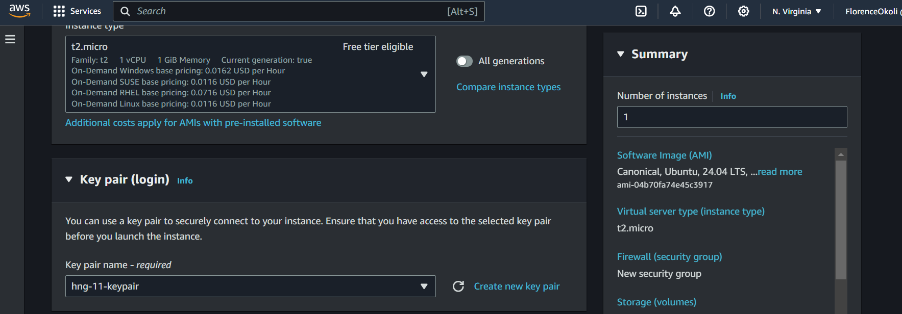

## Deploy a Static website on AWS with Apache Webserver

### Requirements:
* Cloud Platform: AWS EC2 

* Web Server: Apache

* Static Website: A ready-to-deploy static website project (HTML, CSS, Javascript) which includes your Name, username and your email. 

### Step 1 - Launch an EC2 Instance
 * Log in to the AWS console, on the EC2 dashboard, create and launch an instance.

 * Name your instance and select the ami of your choice as well as the instance type.
 

 * Proceed to create/choose a keypair
 

 * Under Security settings, in the inbound rule, createa security group that allows only HTTP traffic from anywhere.
 

 * Leave all other settings on default and proceed to create your instance.

 ### Step 2 - Connect to the instance

 

 