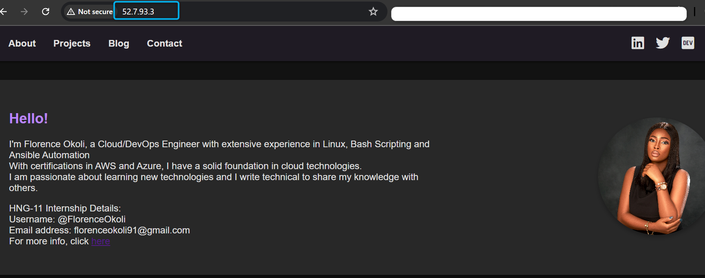

## Deploy a Static website on AWS with Apache Webserver

### Requirements:
* Cloud Platform: AWS EC2 

* Web Server: Apache

* Static Website: A ready-to-deploy static website project (HTML, CSS, Javascript) which includes your Name, username and your email. 

### Step 1 - Launch an EC2 Instance
 * Log in to the AWS console, on the EC2 dashboard, create and launch an instance.

 * Name your instance and select the ami of your choice as well as the instance type.
 

 * Proceed to create/choose a keypair
 

 * Under Security settings, in the inbound rule, createa security group that allows only HTTP traffic from anywhere.
 

 * Leave all other settings on default and proceed to create your instance.

### Step 2 - Connect to the instance
 

 ### Step 3 - Update packages  
  `sudo apt update`
   * Install Apache and Git

   `sudo apt install apache2 -y`

   
      
   

### Step 3 - Create a directory and clone Github repository
   `mkdir Wendy`
   `cd Wendy/`
   `git init`
      

   * Clone Github repo
    `git clone <your GitHub  repo>`

### Step 4- Create a Directory to store you web files 
`sudo mkdir /var/www/wendyhng`

* Then copy the content of the Wendy to /var/www/wendyhng

`sudo cp ./* -R /var/www/wendyhng`
    
* Change directory and create a copy of the default Apache site configuration file and name it wendyhng.conf.
`cd /var/www/wendyhng`

`sudo cp /etc/apache2/sites-available/000-default /etc/apache2/sites-available/wendyhng.conf`

### Step 5 - Edit Configuration File
`sudo nano /etc/apache2/sites-available/wendyhng.conf`

* Edit the document root to serve your web files

* Disable the 000-default file 
` sudo a2dissite 000-default.cong`

* Enable the wendyhng config file
`sudo a2ensite wendyhng.conf`  

### step 6 - Reload Apache to serve your static page

`sudo systemctl reload apache2`

Use your public Ip address to view the page.

### Conclusion 
By following the steps outlined in this guide, you have successfully deployed a static website on an AWS EC2 instance using the Apache web server. This involved launching an EC2 instance, installing necessary packages, cloning your static website project from GitHub, configuring Apache to serve your website, and ensuring your site is accessible over the internet. This setup provides a robust and scalable platform for hosting static content, leveraging AWS's reliable infrastructure. Your website is now live and accessible via the public IP address of your EC2 instance, demonstrating the practical application of cloud services in web hosting.

   

 

 